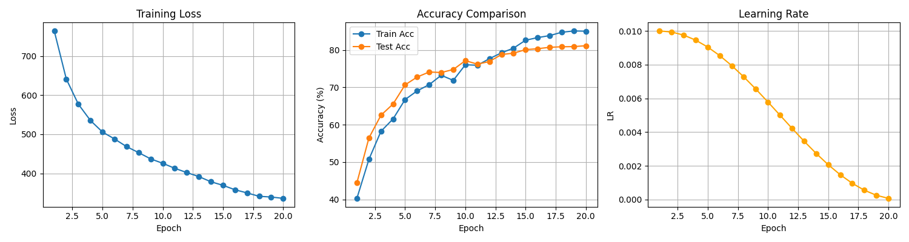

# ML-CIFAR10

## Training Curves

The following figure shows the training loss, accuracy, and learning rate over 20 epochs.




This project implements image classification on the CIFAR-10 dataset using a modified ResNet18 architecture in PyTorch. Key features include:

- Mish activation function (replacing ReLU)
- Mixed Pooling (combination of MaxPooling and AvgPooling)
- Data augmentation (rotation, flip, jitter, grayscale, Gaussian noise)
- CosineAnnealing learning rate scheduler
- Best model checkpoint saved to `models/best_model.pth`

## Project Structure

```
ML/
├── dataset/              # (optional) for custom datasets
├── models/               # stores best_model.pth
├── train.py              # training script
├── training_curves.png   # training loss and accuracy curves
├── requirements.txt      # package dependencies
└── README.md             # this file
```

## Setup Instructions

1. Clone the repository:

```bash
git clone https://github.com/<your-username>/ML-CIFAR10.git
cd ML-CIFAR10
```

2. Install dependencies:

```bash
pip install -r requirements.txt
```

3. Run the training script:

```bash
python train.py
```

The best model will be saved in the `models/` directory, and the training curves will be plotted in `training_curves.png`.

## Dependencies

- torch==2.6.0
- torchvision==0.21.0
- matplotlib==3.10.1
- numpy==2.2.4

## Notes

- The CIFAR-10 dataset will be downloaded automatically via `torchvision.datasets.CIFAR10(download=True)`.
- Do not include the `dataset/` folder in version control if using the official CIFAR-10 dataset.

## Author

Zihao Lian  
University of Illinois Urbana-Champaign, Class of 2025  
GitHub: [@zihao12Lian](https://github.com/zihao12Lian)
